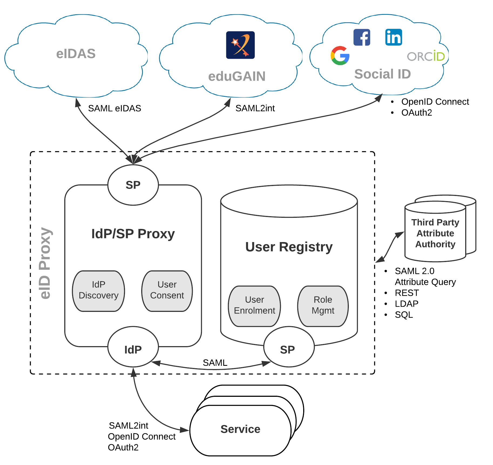

Figure 1 provides a high-level view of the GRNET eID Proxy service architecture illustrating the interconnections with IdPs and SPs. The Proxy acts as an SP towards the external IdPs and, at the same time, as an IdP towards the SPs (e.g. AcademicID Service). Through the proxy, users are able to authenticate with their eIDAS credentials. To achieve this, the proxy supports the translation between different authentication protocols, such as SAML (eIDAS and SAML2int profile), OpenID Connect and OAuth 2.0. The proxy also provides a country selector for users to select their country of origin eIDAS node (Home eIDAS Node).

|  |
|:--------------------:|
| *Figure 1. GRNET eID Proxy high-level architecture* |

The proxy is also connected to the IdPs of the universities and research institutes that participate in the eduGAIN interfederation [2], as well as other social identity providers, such as Google, Facebook, LinkedIn, and ORCID. 

